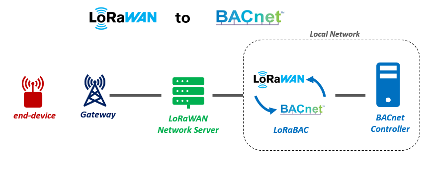

# LoRaBAC, an open-source LoRaWAN to BACnet interface
The [LoRaBAC node](https://flows.nodered.org/node/@montagny/node-red-contrib-lorawan-bacnet) is the configuration node of the [LoRaBAC application](https://github.com/SylvainMontagny/LoRaBAC).

- [LoRaBAC, an open-source LoRaWAN to BACnet interface](#lorabac-an-open-source-lorawan-to-bacnet-interface)
  - [**1. Overview**](#1-overview)
    - [**1.1. What is LoRaBAC?**](#11-what-is-lorabac)
      - [**Key Features:**](#key-features)
    - [**1.2. What Makes LoRaBAC Unique?**](#12-what-makes-lorabac-unique)
      - [**Drawbacks:**](#drawbacks)
    - [**1.3. Support**](#13-support)
  - [**2. Prerequisites**](#2-prerequisites)
    - [**2.1. LoRaWAN End-Device**](#21-lorawan-end-device)
    - [**2.2. MQTT Broker**](#22-mqtt-broker)
    - [**2.3. Node-RED Setup**](#23-node-red-setup)
      - [**Additional Packages for ChirpStackV4:**](#additional-packages-for-chirpstackv4)
      - [**Quick Start with Docker:**](#quick-start-with-docker)
  - [**3. Getting Started**](#3-getting-started)

## **1. Overview**
### **1.1. What is LoRaBAC?**
LoRaBAC is open-source application built on **Node-RED**. It allows you to integrate LoRaWAN devices with BACnet controllers, making it ideal for **smart building applications**.

#### **Key Features:**
- **Universal Compatibility:**
  - [x] Works with **all LoRaWAN end-devices** and **gateways**.
  - [x] Supports **ChirpStack**, **Actility**, and **The Things Stack** (The Things Network / The Things Industries) Network Servers.
  - [x] Integrates with **all BACnet controllers** using native BACnet protocols (or **Distech-Controls controllers** when using Rest API).

- **Bidirectional Communication:**
  - [x] **Uplink:** Writes LoRaWAN payloads to specific BACnet objects.
  - [x] **Downlink:** Writes BACnet objects to specific LoRaWAN payload.

- **Proven Use Cases:**
  - [x] Thermostatic valves
  - [x] Temperature and humidity sensors
  - [x] Air quality sensors
  - [x] Current monitoring sensors
  - [x] Pilot wired electric heater controller

### **1.2. What Makes LoRaBAC Unique?**
LoRaBAC is designed with a **different approach** compared to other LoRaWAN-BACnet interfaces. Here’s why it stands out:

**Advantages** :

1. **BACnet Client Architecture:**
   - Unlike most interfaces that act as **BACnet servers**, LoRaBAC operates as a **BACnet client**. It only interacts with the controller when a LoRaWAN payload is received, reducing unnecessary traffic.

2. **Flexible Deployment:**
   - LoRaBAC can be installed **anywhere**:
     - On the **LoRaWAN Gateway**
     - Within the **local network**
     - Directly on the **BACnet controller**

3. **Open Source and Free:**
   - LoRaBAC is **free to use** and **open-source** under the **MIT License**, offering full transparency and customization.

#### **Drawbacks:**
1. **No "Who-is" Service Support:**
   - LoRaBAC does not respond to the **"Who-is" service**, which can be useful for discovering BACnet devices in some setups.

2. **Manual Configuration Required:**
   - Each new LoRaWAN device type requires **manual configuration**. It is not a "Plug and Play" solution.

### **1.3. Support**
To get support on LoRaWAN or LoRaBAC, please refers to the following ressources, or [reach us](https://www.univ-smb.fr/lorawan/en/contact/) out.

:tv: Webinar Replay: [LoRaWAN and BACnet interfaces for Smart Building]()

:notebook: Free ebook:[LoRaWAN for beginers books](https://www.univ-smb.fr/lorawan/en/free-book/)

:tv: E-learning platform: [LoRaWAN for beginers videos](https://www.udemy.com/course/lora-lorawan-internet-of-things/?referralCode=21DED0F1021F4E261955)

:tv: E-learning platform for Advanced users: [LoRaWAN for Advanced users videos](https://www.udemy.com/course/lorawan-for-advanced-users/?referralCode=BA4A670560916E1AED77)

:bulb: 2 days training sessions: [LoRaWAN and IoT Training](https://www.univ-smb.fr/lorawan/avada_portfolio/formation-distanciel/)

## **2. Prerequisites**
### **2.1. LoRaWAN End-Device**
To use LoRaBAC you will need:
- a LoRaWAN **Network Server** (ChirpStack, TTN or Actility).
- The device **payload decoders** (for uplink).
- the device **payload encoders** (for downlink, if needed).

Payload decoder and encoders should be provided by your device manufacturer, however, in this repository you will find the payload codec of the tested devices.

### **2.2. MQTT Broker**
LoRaBAC relies on an **MQTT broker** for communication. You can use:
- The built-in MQTT broker provided by **ChirpStack**, **Actility**, or **The Things Stack**.
- Your own **custom MQTT broker**.

### **2.3. Node-RED Setup**
LoRaBAC is a **Node-RED flow**, so you need a **Node-RED instance** to run it. Ensure the following packages are installed:

- @montagny/node-red-contrib-lorawan-bacnet

#### **Additional Packages for ChirpStackV4:**
If you’re using **ChirpStackV4** and want to enable the **"Flush Downlink Queue"** feature, install:
- `@grpc/grpc-js`
- `@chirpstack/chirpstack-api`

#### **Quick Start with Docker:**
A pre-configured **Node-RED Docker image** is available on [Docker Hub](https://hub.docker.com/r/montagny/node-red/tags). It includes all required packages for easy deployment.

## **3. Getting Started**
Please, follow the information given in the [LoRaBAC application](https://github.com/SylvainMontagny/LoRaBAC).